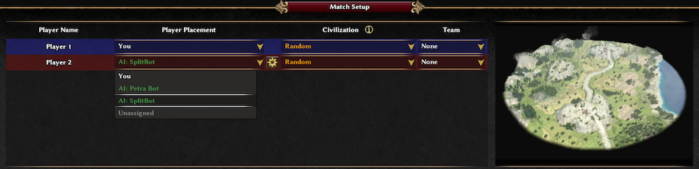

## Introduction

[Wildfire Games](http://wildfiregames.com/), an international group of volunteer game developers, develops [0 A.D., a free, open-source game of ancient warfare](http://play0ad.com/).

In the game, there can be teams managed by the computer. The AI which plays these teams is called a bot, and is is a small program wrtten in [javascript](https://en.wikipedia.org/wiki/JavaScript), interpreted by the game engine. The game itself is written in C++.

## About Split Bot

Split Bot is developed in [Haxe](http://haxe.org) which is a very structured language which can be "compiled" in javascript code.

This AI Bot is made of multiple agents.

Each one has a goal which may be different or even contradictory, e.g. defend the home and attack the enemy. An agent is created by another agent in function of several indicators: the game state, the game state evolution, a knowledge base, hazard.

## Play against Split Bot

* [Download and install 0ad](http://play0ad.com/)
* [download Split Bot](https://github.com/lexoyo/split-bot)
* unzip Split Bot folder and move the content of the `bin/` folder to `~/Library/Application\ Support/0ad/mods/public/simulation/ai/splitbot/` (on MAC) or `~/.local/share/0ad/mods/public/simulation/ai/Splitbot` (on Ubuntu) - you may have to create the folders.

Then start a solo game, and choose Split Bot as AI for an opponent.



## Hack in Split Bot

```
$ ln -s [absolute path to split-bot repo]/bin/ ~/Library/Application\ Support/0ad/mods/public/simulation/ai/splitbot
$ sudo chmod 0777 start_game_for_test.sh
```

Start the game automatically on Mac

```
$ ./start_game_for_test-mac.sh
```

Or on Linux

```
$ ./start_game_for_test-linux.sh
```

Or even on windows

```
$ ./start_game_for_test.bat
```

## Development status

Currently the bot builds a village quickly, defends itself and attacks in teams, but do not split yet.

Split Bot builds strong soldiers, and attacks in waves of 15 soldiers.

The defense is quite efficient since it does detect that it is under attack, and counter-attacks. It also builds defense towers.

